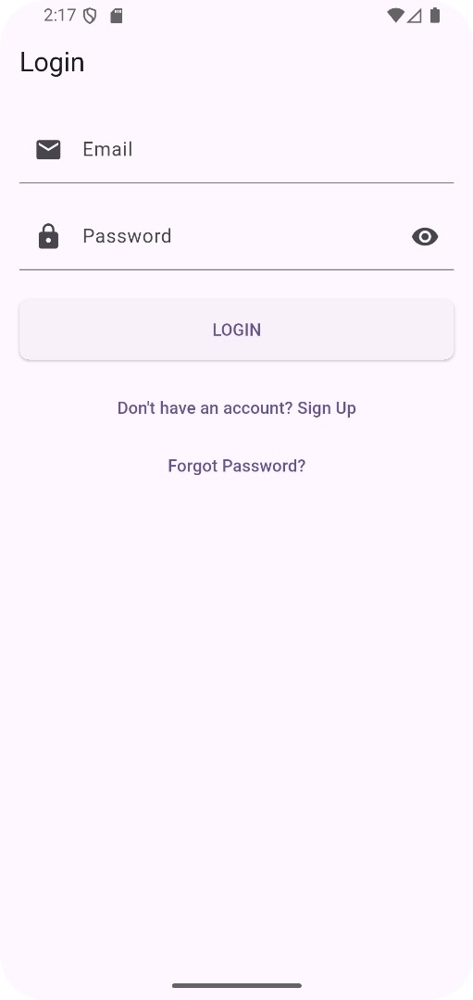

# Charity Bridge
Charity Bridge is a meticulously crafted application, developed with Android Studio, envisioned with the objective of simplifying and promoting charitable actions. The purpose of the application is to establish a reliable and efficient channel between donors and those in need.

---

## 📝 Getting Started

To get this project up and running on your machine, you will need to set up your Firebase project and configure the Flutter application to connect to it.

### 📃 Prerequisites

Ensure you have the following software installed:

* *Flutter SDK:*
    * Follow the official installation guide: [Flutter Install Guide](https://flutter.dev/docs/get-started/install)
    * After installation, run flutter doctor in your terminal to verify your setup.

* *Google Account:* Required to create and manage a Firebase project.
* *Firebase CLI (Optional, but recommended for advanced features):*
    * Install it by following the instructions here: [Firebase CLI Docs](https://firebase.google.com/docs/cli#install_the_firebase_cli)
* *Version Control:* Git (to clone the repository).

---

## 🏃‍➡️ Running the Application

1.  *Clone the Repository:*
    Run these commands in you terminal:
    git clone <repository_url>
    cd <project_directory_name>

2.  *Install Flutter Dependencies:*
    * In the root of your Flutter project (where pubspec.yaml is located):
      Run;
      flutter pub get

3.  *Verify Firebase Configuration Files:*
    * This project expects the following Firebase configuration files to be present:
        * For Android: android/app/google-services.json
        * For iOS: ios/Runner/GoogleService-Info.plist
        * For all platforms: lib/firebase_options.dart (generated by flutterfire configure)
    * If these files are missing after cloning, you will need to obtain them from your Firebase project's console and place them in the correct directories. You might also need to run flutterfire configure if firebase_options.dart is missing or outdated.

    
4.  *Prepare a Device/Emulator:*
    * *Android Emulator/Physical Android Device*
    * *iOS Simulator/Physical iOS Device (macOS only)*
    * *Web Browser*
    * *Desktop (Windows, macOS, Linux)*

    To list available devices, run:
    flutter devices

5.  *Run the Flutter Application:*
    * With your chosen device/emulator ready, execute the following command in the project's root directory:
      Run;
      flutter run

        * To run on a *specific device* (use its ID from flutter devices):
          flutter run -d <device_id>

        * To run on a *web browser*:
          flutter run -d chrome # or another browser like edge, firefox

        * To run as a *desktop app*:
          flutter run -d windows # or macos, linux

    The application will build and launch on your selected target, connecting to the Firebase project configured in google-services.json, GoogleService-Info.plist, and firebase_options.dart.

---

## 📸 Screenshots
### Welcome screen;
- 

### Login screen;
- 

### Signup screen;
- 

### Donor:
- Donor Dashboard;
- 
- Make a Donation screen;
- 
- Donation History;
- 
- Donor Notifications;
- 
- Contact Support for Donors;
- 
- Donor Report a Problem;
- 
- Donor Settings;
- 
- Donor Profile;
- 

### Admin:
- Admin Dashboard;
- 
- Manage Users screen;
- 
- View Reports screen;
- 
- Admin Organization Approval screen;
- 
- Issue Reports screen;
- 
- Admin Notifications;
- 
- Admin Settings;
- 
- Admin Profile;
- 

### Organization:
- Organization Dashboard;
- 
- Donation Statistics;
- 
- Create a Donation Request screen;
- 
- Organization Settings;
- 
- Organization Report a Problem;
- 
- Contact Support for Organization;
- 
- Organization Notifications;
- 
